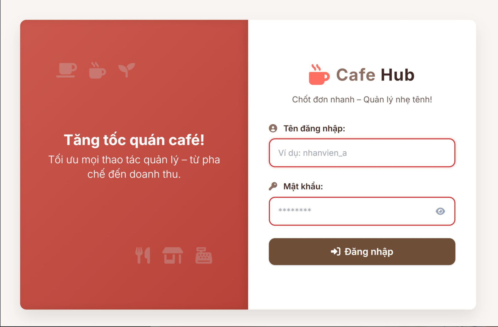
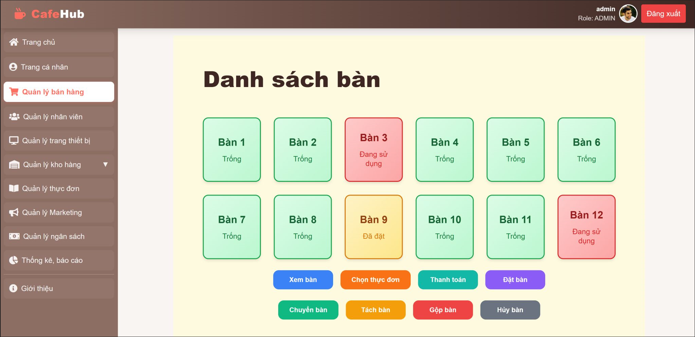

# Quản Lý Quán Cafe

## Giới thiệu

Dự án này là hệ thống quản lý quán cafe, hỗ trợ các nghiệp vụ như quản lý nhân viên, thực đơn, doanh thu, kho hàng, khuyến mãi, đặt bàn, v.v. Dự án được xây dựng theo mô hình Spring Boot, sử dụng giao diện web hiện đại.




## Tính năng chính

- Quản lý tài khoản nhân viên
- Quản lý thực đơn, món ăn, đồ uống
- Quản lý kho hàng, nhập/xuất sản phẩm
- Quản lý doanh thu, báo cáo
- Quản lý khuyến mãi
- Đặt bàn, thanh toán, gộp bàn, tách bàn

## Cài đặt

1. Clone dự án về máy:
   ```bash
   git clone https://github.com/mirodoan/cafe_management_miro.git
   ```
2. Cài đặt JDK 17 trở lên và Maven
3. Cấu hình cơ sở dữ liệu trong `src/main/resources/application.properties`
4. Chạy lệnh build và khởi động:
   ```bash
   ./mvnw clean install
   ./mvnw spring-boot:run
   ```

## Cấu trúc thư mục

```
src/
	main/
		java/com/viettridao/cafe/   # Mã nguồn Java
		resources/
			static/                    # Tài nguyên tĩnh (JS, CSS)
			templates/                 # Giao diện HTML
	test/
		java/com/viettridao/        # Unit test
```

## Hướng dẫn sử dụng

1. Truy cập giao diện web tại địa chỉ: `http://localhost:8080`
2. Đăng nhập bằng tài khoản được cấp
3. Sử dụng các chức năng theo phân quyền

## Công nghệ sử dụng

- Java 17, Spring Boot
- Thymeleaf, HTML, CSS, JavaScript
- MySQL/PostgreSQL
- Maven
